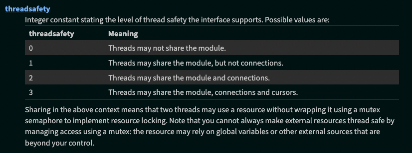
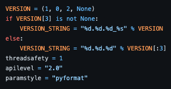
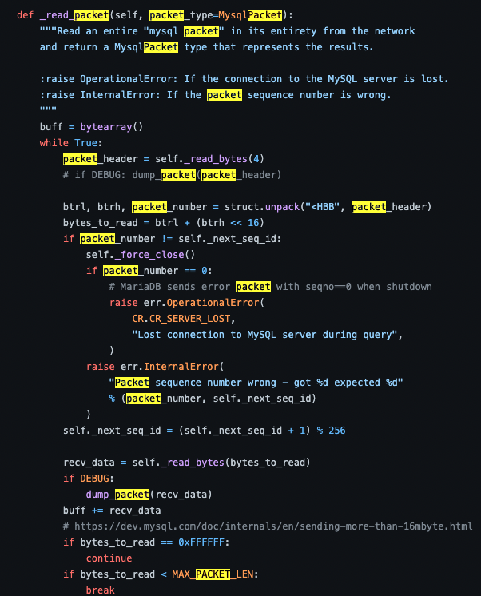

# PyMySQL

최초 작성날짜 : 2022년 6월 18일
최종 수정날짜 : 2022년 6월 22일

문제 구현에 사용한 데이터 베이스는 MySQL Sample Database에서 가져왔습니다.
<br>
https://www.mysqltutorial.org/mysql-sample-database.aspx/

## 문제상황
[테스트 코드](test_pymysql.py) 
<br>
구현 커밋 : 5022157

위에서 구현된 테스트 코드는 서버에 구현된 api를 멀티쓰레드로 호출하는 상황이다.
<br>
해당 테스트 실행결과 발생하는 오류는 아래와 같다.

```shell
 pymysql.err.InternalError: Packet sequence number wrong - got 53 expected 15
```

## 원인

이는 pymysql의 thread safety정도가 1이여서 발생하는 문제이다.

먼저 파이썬에서 정의하는 thread safety 단계를 살펴보자.



이제 pymysql 소스코드를 들여다보자
https://github.com/PyMySQL/PyMySQL/blob/main/pymysql/__init__.py



여기서 우리는 pymysql의 threadsafety 레벨이 1인것을 알 수 있고 이에 따라 connection에 대한 thread safety가 적용이 안되는 것을 알 수 있다.

## 해결책

프로젝트에서 발생했을 때는 db로 보내는 connection에 대해 thread lock을 걸어 해결했다.

```python
import pymysql


class Database():
    def __init__(self):
        self.db = pymysql.connect(host='',
                                  user='',
                                  db='',
                                  password='')
        
        self.cursor = self.db.cursor(pymysql.cursors.DictCursor)

    def execute(self, query, args={}):
        self.cursor.execute(query, args)

    def executeOne(self, query, args={}):
        self.cursor.execute(query, args)
        row = self.cursor.fetchone()
        return row

    def executeAll(self, query, args={}):
        self.cursor.execute(query, args)
        row = self.cursor.fetchall()
        return row

    def commit(self):
        self.db.commit()
```
위와 같은 코드를

```python
import pymysql
from threading import RLock

class Database():
    def __init__(self):
        self.LOCK = RLock()
        self.db = pymysql.connect(host='',
                                  user='',
                                  db='',
                                  password='')
        
        self.cursor = self.db.cursor(pymysql.cursors.DictCursor)

    def execute(self, query, args={}):
        self.cursor.execute(query, args)

    def executeOne(self, query, args={}):
        with self.LOCK:
            self.cursor.execute(query, args)
            row = self.cursor.fetchone()
        return row

    def executeAll(self, query, args={}):
        with self.LOCK:
            self.cursor.execute(query, args)
            row = self.cursor.fetchall()
        return row

    def commit(self):
        self.db.commit()

```

query를 보낼때 이를 thread lock을 걸어서 실행시키도록 했을 때는 
아까의 테스트가 통과되는 것을 확인할 수 있다.

## 왜...?

> 🤷 pymysql은 왜 multithread를 지원하지 못하는가

그럼 위에서 발생한 오류인 Packet sequence number wrong 에 집중을 해보자
<br>
해당 오류가 발생하는 소스코드의 부분을 보면 아래와 같다.



아까와 같은 오류가 발생하는 원인은 현재 받은 packet_number과 next_seq_id가 달라서 생기게 된다는 걸 알 수 있다.

위의 코드를 이해하기 위해서는 packet_number와 next_seq_id를 이해해야한다.
### packet number & seq_id
mysql packet을 보낼 때 정보를 보면

```python
data = _pack_int24(len(payload)) + bytes([self._next_seq_id]) + payload
```
아래와 같은 방식으로 data를 packing하고 이를 socket에 보내게 된다. 즉, pymysql에서는 mysql 서버로 packet을 보낼 때 이를 구분하기 위해 packet에 seq_id를 넣어서 보내게 된다고 이해할 수 있다..

여기서 내가 짠 코드로 다시 돌아가보자.
나는 flask의 app.py를 다음과 같이 구성하였다.
```python
def create_app():
    app = Flask(__name__)
    db = db_connection.Database()
    ...
    return app

```
즉, pymysql로 생성하는 db connection에 대한 인스턴스를 모든 controller가 공유 한다는 것이다.
<br>
single thread를 사용하면 공유는 하지만 순차적으로 실행 되기 때문에 문제가 없을 것이다.
<br>
하지만 multithread는 다르다. 병렬적으로 실행되면서 같은 소켓을 공유하기 때문에 아까와 같은 문제가 발생 할 수 있는 것이다.

> ## 결론
> 
> pymysql은 packet을 보낼 때 이를 구분하기 위한 seq_id를 넣게 되는데 multithread로 실행하게 되면 해당 seq_id의 순서가 섞이게 되어 패킷에 있는 seq_id가 응답으로 받을 때 달라지게 되는 문제가 발생하는 것이다.
